# Guía de ltsp-raspi-builder


## Preparación del servidor

#### Instalamos el sistema operativo, en este caso se va a utilizar lubuntu 18.04.

### 1. Procederemos a la **instalación del paquete** 
	
```
ltsp-raspi-builder_0.0.2_amd64.deb
```
[Descargar paquete.](https://github.com/sanchezasix/ltsp-raspi-builder/raw/master/ltsp-raspi-builder_0.0.2_amd64.deb)
#### Ejecutaremos como root o sudo el siguiente comando para la instalación del paquete:
		
En este paso convertiremos el equipo en un Servidor LTSP instalaremos todos los paquetes necesarios para poder utilizar el equipo como servidor ltsp y también nos dejará unas plantillas y scripts para facilitar la configuración del servidor que mas tarde ejecutaremos una vez seguidos unos pasos previos a la configuración, también nos dejará unos archivos que los utilizaremos para copiarlos al chroot para su configuración para así generar la imagen de sistema ya configurada.

		gdebi ltsp-raspi-builder_0.0.2_amd64.deb

### 2. Preparación previa a la configuración del servidor LTSP.

Añadiremos el siguiente repositorio para poder descargar los paquetes necesarios para la creación del chroot en el servidor LTSP.
		sudo add-apt-repository --yes ppa:ts.sch.gr
		Ejecutamos apt update para preparar el siguiente paso.

Importamos la clave y la guardamos en /etc/ltsp/ que es de donde va a buscar la plantilla de creación del chroot que vamos a utilizar para la creación del chroot y la guardamos con el nombre ts_sch_gr-ppa.key , nos permitirá descargar los paquetes del repositorio indicado en la plantilla de la creación del chroot.

Muy importante hay que ejecutar el siguiente comando como root y no nos sirve con sudo, para ello seguiremos los siguientes comandos.

		sudo -i
		apt-key export 03AFA832> /etc/ltsp/ts_sch_gr-ppa.key

Descargamos los paquetes que nos va dar la posibilidad de crear un chroot de un sistema con una arquitectura diferente, en este caso la arquitectura que utiliza la Raspberry Pi es armhf. 


		apt --yes install qemu-user-static binfmt-support

### 3. Configuración del servidor:


Resumen del orden de ejecución de los scripts que vamos a seguir en la configuración:

Ruta donde se guardan: /usr/sbin/
* **ltsp-raspi-builder-dnsmasq**
* **ltsp-raspi-builder**
* **ltsp-raspi-builder-sd**


#### Configuración del dnsmasq y el servicio routing.

El primer paso a seguir en la ejecución de los scripts es la configuración de el dnsmasq y asignar a la tarjeta interna una ip fija para que sirva el servidor como DHCP y DNS interno de la red y también se utilizará la ip recogida del servido para calcular la red y la tarjeta de red externa para crear el script que ejecutará el servicio llamado routing, que es el encargado de hacer que cada vez se ponga en marcha el servidor, se añaden las reglas iptables de enrutamiento a la tabla NAT que es la que se encarga de hacer el redireccionamiento de los paquetes de una red a otra.


	Ejecutamos: sudo ltsp-raspi-builder-dnsmasq

* **Pedirá en la primera ventana que seleccionemos la tarjeta de red que vamos a utilizar como interna.**

	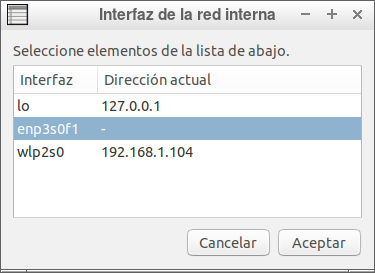

* **En la segunda ventana seleccionaremos la tarjeta de red que vamos a utilizar como externa.**

	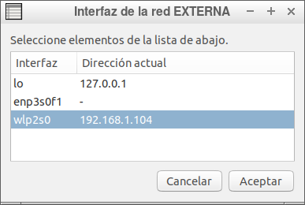

* **En la tercera ventana nos pedirá la ip que queremos asignar al servidor en la red interna, la máscara de red, el nombre del dominio, ip inicial y ip final para el asignacion de ips por DHCP.**

	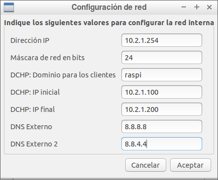

* **Con estos pasos tenemos la configuración de el dnsmasq, creado el servicio routing con la ip y tarjeta correspondiente, una vez aparezca la siguiente ventana y haya finalizado habremos terminado la configuración.**

	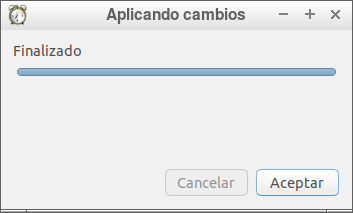


### 4. Creación de el chroot y generar imagen.

Crearemos el chroot que utilizaremos para generar la imagen del sistema, que va a proporcionar el servidor LTSP a las Raspberry Pi’s, y generamos la imagen del sistema con todos los paquetes y configuración que hemos realizado en el desarrollo de la solución.

**Para ello ejecutamos el script ltsp-raspi-builder que lo realizara todo automáticamente.**

		Ejecutamos con: sudo ltsp-raspi-builder

* **Nos pedirá que seleccionemos una imagen, que es la que nos asignará de fondo de pantalla para los usuarios.**

	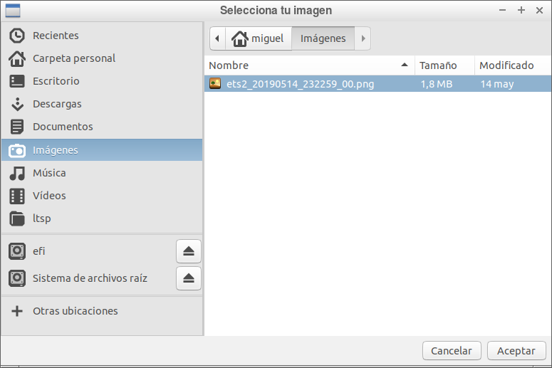


Una vez seleccionada la imagen para el fondo, empezará la generación del chroot y una vez generado, se generará la imagen del sistema a partir del chroot generado en /opt/ltsp, en este caso con el nombre lubuntupi.

.
	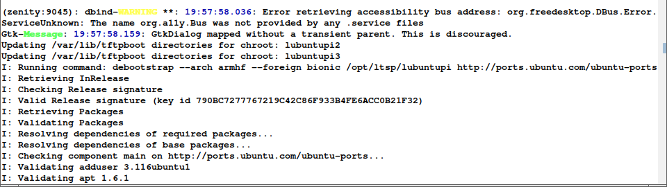 

Cuando se termine de generar la imagen nos aseguramos que ha terminado correctamente la creación de la imagen del sistema , subimos en el terminal hacia arriba hasta encontrar la barra del porcentaje y buscamos un poco más hacia arriba y buscamos la linea que pone la instalación del cliente LTSP se completo satisfactoriamente, en el caso de que no se generará correctamente pondría la instalación del cliente LTSP no se completo satisfactoriamente .

.
 	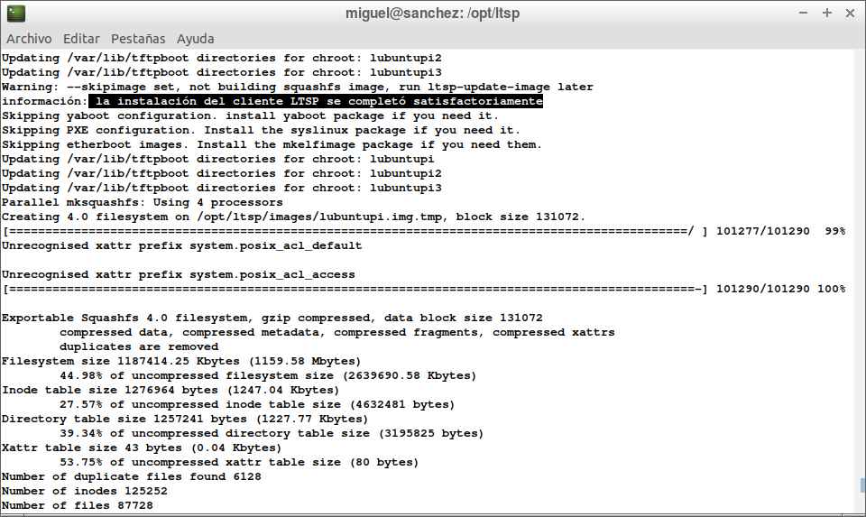
.
	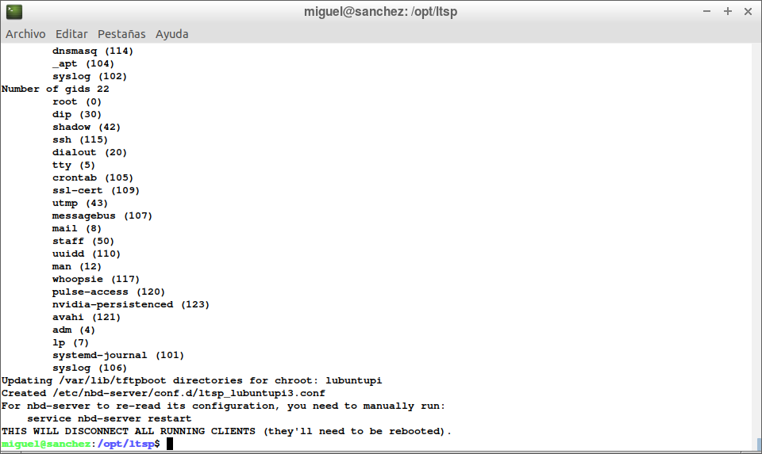


* **Reiniciamos el servicio nbd-server para asegurarnos que cuando arranquemos la Raspberry Pi el servidor LTSP sirva la imagen del sistema.**

	sudo service nbd-server restart.

### 5. Generar Boot para Raspberry Pi.

**1. Generamos el boot para la raspberry pi.**

Utilizaremos el script ltsp-raspi-builder-sd para generar el boot que utilizaremos para que la raspberry pueda ejecutar el sistema como cliente del servidor LTSP.

		Ejecutamos con: sudo ltsp-raspi-builder-sd

Aparecerá una ventana que es para seleccionar donde queremos que carpeta queremos que nos genere el boot para la raspberry.
.
	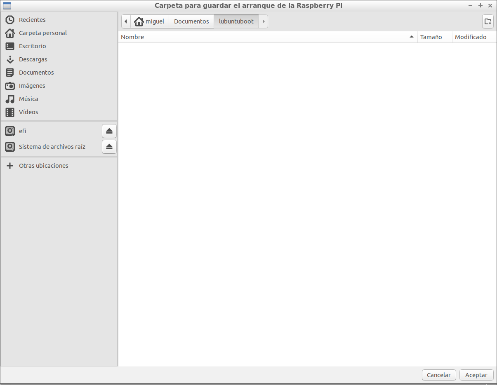


Una vez seleccionada, nos creará el boot.
.
	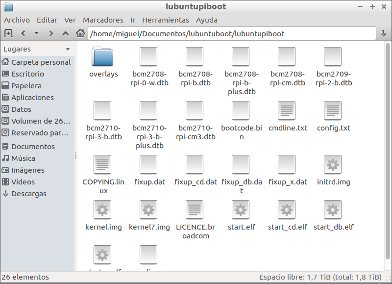


**2. Copiar el Boot en la SD para la Raspberry Pi.**
.
	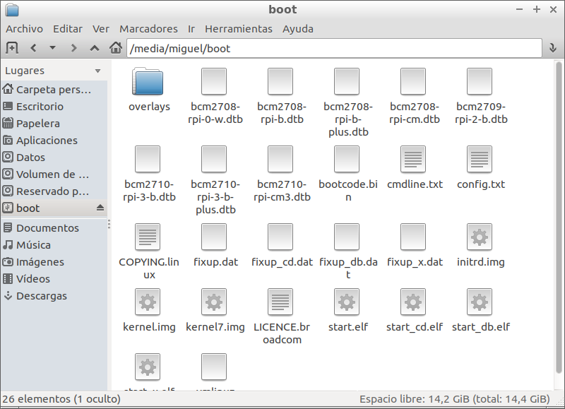


**3. Probar que funciona todo correctamente.**	
.
	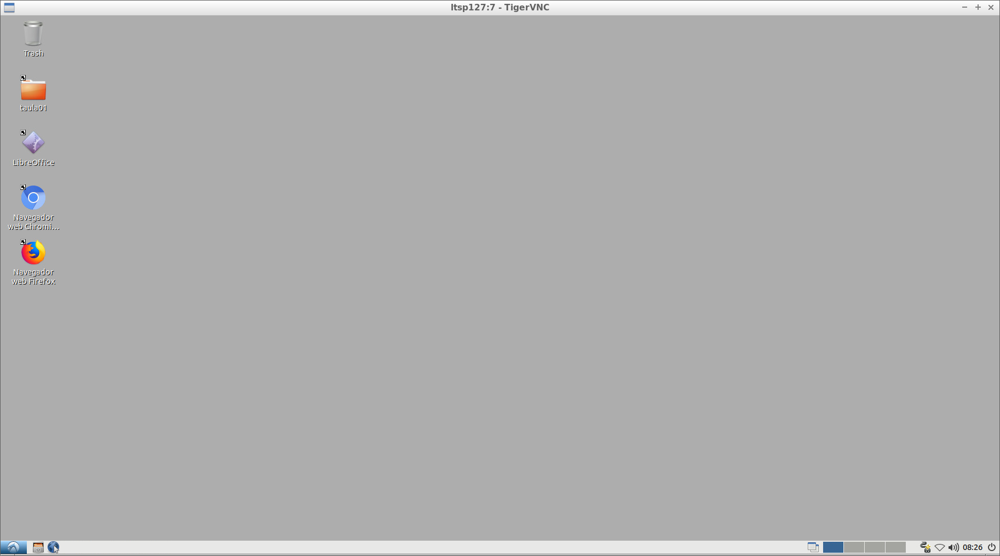

